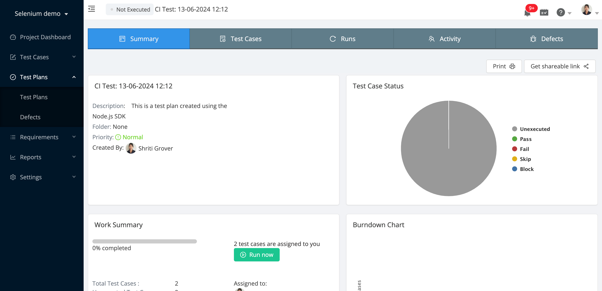
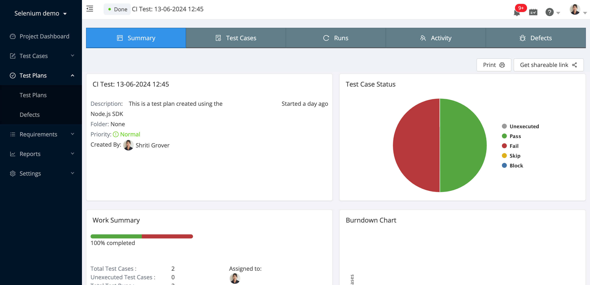

# Playwright integration with Test Collab

This project demonstrates how to upload your playwright test report to Test Collab, with your CI/CD pipeline.

## Prepare your Test Collab instance

We recommend creating a tag named 'ci' or something similar to cluster all test cases that are part of your CI/CD pipeline. Apply this tag to the necessary test cases so that they can be included in your report for every build.

1. Select a project > Click 'Tags' under the 'Test Cases' tab on the left
2. Create a new tag or use an existing one
3. Keep a note of the id of the tag by hovering over the 'Edit' link '...' (you will need this later)

Also obtain your 
* project id, 
* company id, and 
* id of the user to whom these test cases will be assigned 

In the case of CI/CD pipelines, although the test execution is fully autonomous, TestCollab still requires an assignee to be present. This could be your own user id. 

Next, create a new API key as explained here: https://help.testcollab.com/en/articles/5299051-getting-an-api-token-generated

## Setup

- node version: v20.15.1

- Initialize .env file, using   

    cp sample.env .env

- Fill all the related values in .env

    NODE_ENV=production

    TESTCOLLAB_API_KEY=

    TESTCOLLAB_PROJECT_ID=

    TESTCOLLAB_CI_TAG_ID=

    TESTCOLLAB_ASSIGNEE_ID=

    TESTCOLLAB_COMPANY_ID=

### Pre-requisites:
* Playwright - installed and configured
* Playwright scripts to be present in `tests` folder

## Firing a test run

Let's trigger our playwright test cases now (this will open chrome, if UI mode is opted)

    npm run test

Now we'll create a test plan in your Test Collab project. (before this make sure that tmp folder exists)

    npm run createTestPlan

At this point you'll be able to see this new test plan under Test Plans menu.
However, all test cases will show up as 'Unexecuted' as shown in image below:

After all the test cases are done, you'll see the report file:
./mochawesome-report/mochawesome.json

Now, finally, we send the results to Test Collab:

    npm run report

If you see the following error while running `npm run report`
    `sh: 1: source: not found`
then you may need to run the command written below and then try again `npm run report`
    `npm config set script-shell "/bin/bash"` 

